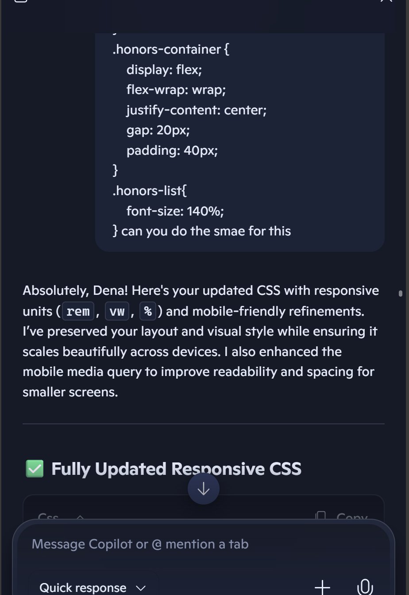
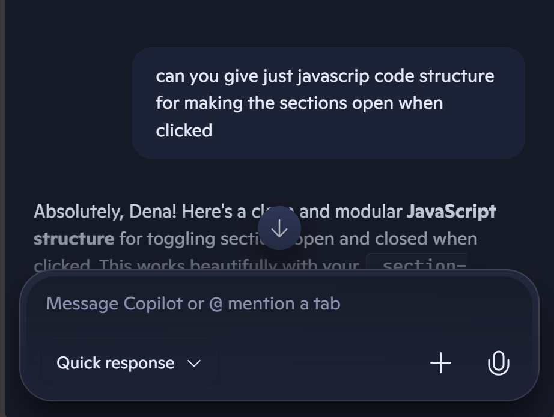

# 🧠 AI Usage Report

### Project: Personal Portfolio Website

**Author:** Dena Alharbi  
**Date:** 25 September 2025

---

## 🎯 Purpose of AI Integration

This report outlines how AI tools were used to support the design, development, and refinement of my personal portfolio
website. The goal was to enhance productivity, troubleshoot layout issues, and explore creative design ideas while
maintaining full ownership of the final product.

---

## 🛠️ Tools Used

- **Microsoft Copilot** – for layout debugging, design suggestions, and creative brainstorming
- **ChatGPT** – for occasional syntax checks and UI inspiration
- **A website** - for reusable components was used [https://codepen.io/simoberny/pen/pJZJQY](https://codepen.io/simoberny/pen/pJZJQY)
---

## 📌 Areas Where AI Was Used

### 1. Layout Troubleshooting

- Debugged errors
- Refined modal and dropdown behavior for the contact section

### 2. Responsive Design

- Suggested flexbox strategies for centering `.intro-wrapper`
- Helped contain overflowing content inside scrollable containers
- Provided CSS transitions and javascript code for smooth section opening

### 3. Creative Enhancements

- Brainstormed animation ideas for section reveals
- Helped with refining and enhancing my css code
- Added comments to the code to make the project maintainable
- Proposed typography pairings and gradient overlays
- Offered README and docs structure and branding language

### 4. Code Optimization

- Recommended to add texture to the website using https://www.transparenttextures.com/
- Suggested semantic HTML improvements and suggestion on how should my content be grouped

---

## 🔍 AI Contribution vs. Human Work examples

| Task                        | AI Role                          | My Role                             |
|-----------------------------|----------------------------------|-------------------------------------|
| Section transitions         | Provided CSS logic               | Tuned timing and aesthetics         |
| Docs creation               | Drafted structure                | Customized tone and content         |
| Portfolio branding ideas    | Offered inspiration              | Selected and refined visuals        |
| Navbar design               | Suggested layout and hover logic | Adjusted spacing and typography     |
| README styling              | Proposed Markdown layout         | Added branding, links, and visuals  |
| Responsive layout fixes     | Diagnosed flex/grid issues       | Tweaked breakpoints and padding     |
| Color palette ideas         | Generated modern combinations    | Chose final scheme to match vibe    |
| Social media sidebar        | Gave vertical layout logic       | Positioned and styled icons         |
| Texture layering            | Explained CSS techniques         | Selected final pattern and opacity  |
| Typography pairing          | Suggested font combos            | Picked weights and applied hierarchy|
| Project card hover effects  | Wrote transition logic           | Tuned animation speed and depth     |
| Section spacing             | Proposed margin/padding rules    | Balanced visual rhythm manually     |

---

## Chat Snippets Examples

 
>  🧾 Ethical Note :  All AI-generated suggestions were reviewed and edited by me to ensure originality, accuracy, and alignment with my personal style and goals. I maintained full creative and technical control throughout the project. 

For example:
   
- In this example I made the copilot convert the units to responsive just to amek the process faster and then i tested it and every time there would be something to change. So because i understand my code i would tweak the numbers until it looks perfect.  
   

- Here I was trying to figure out the javascript of making sections open and i have no experience in this so i asked for the structure and tweaked it to fit my class names and purpose. AI made the process easier and faster but mistakes were still found!

## 🤖 Reflections on Using AI in My Portfolio Journey

As a student building my first personal website, integrating AI into my workflow was both empowering and eye-opening. Here’s a breakdown of how it helped—and where it challenged me.

### ✅ Benefits

- **Faster Learning Curve**  
  AI helped me grasp new concepts quickly by breaking down CSS, layout logic, and animation techniques in ways that made sense—even when I had no prior experience.

- **Debugging Support**  
  Whenever I hit layout issues or responsiveness bugs, AI was like a second pair of eyes. It helped me troubleshoot faster and gave me confidence to experiment.

- **Creative Inspiration**  
  From branding ideas to UI enhancements, AI offered suggestions that sparked my creativity and pushed me to refine my design choices.

- **Documentation Drafting**  
  Structuring my README and technical docs was easier with AI-generated templates that I could personalize to match my tone and style.

### ⚠️ Challenges

- **Misunderstood Intentions**  
  Sometimes, the AI didn’t fully grasp what I was trying to achieve visually or structurally, which led to suggestions that didn’t quite fit.

- **Occasional Inaccuracies**  
  A few answers were misleading or outdated, especially when dealing with browser quirks or advanced CSS behavior. I had to double-check and test everything manually.

- **Limited Context Awareness**  
  Without seeing my full code or design vision, the AI occasionally gave generic advice that needed heavy tweaking to work in my specific layout.

---

### 💡 Final Thoughts

Using AI didn’t replace learning—it accelerated it. It gave me a foundation to build on, but I still had to make the final decisions, test my code, and refine the design. The process taught me to think critically, ask better questions, and trust my own instincts as a developer.

## 🚀 Future Use of AI

In future projects, I plan to continue using AI tools to accelerate development and enhance quality. This includes
leveraging AI for accessibility audits, performance optimization, semantic HTML structuring, and creative ideation. I
also aim to explore AI-assisted testing and documentation generation to streamline workflows while maintaining full
authorship and oversight.

---
