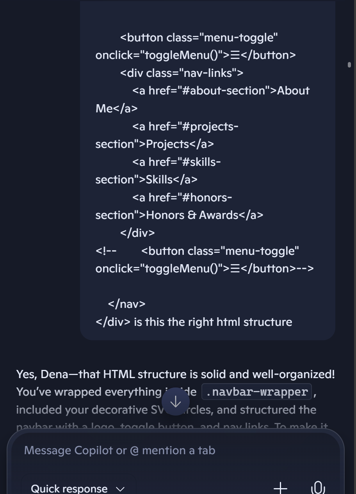
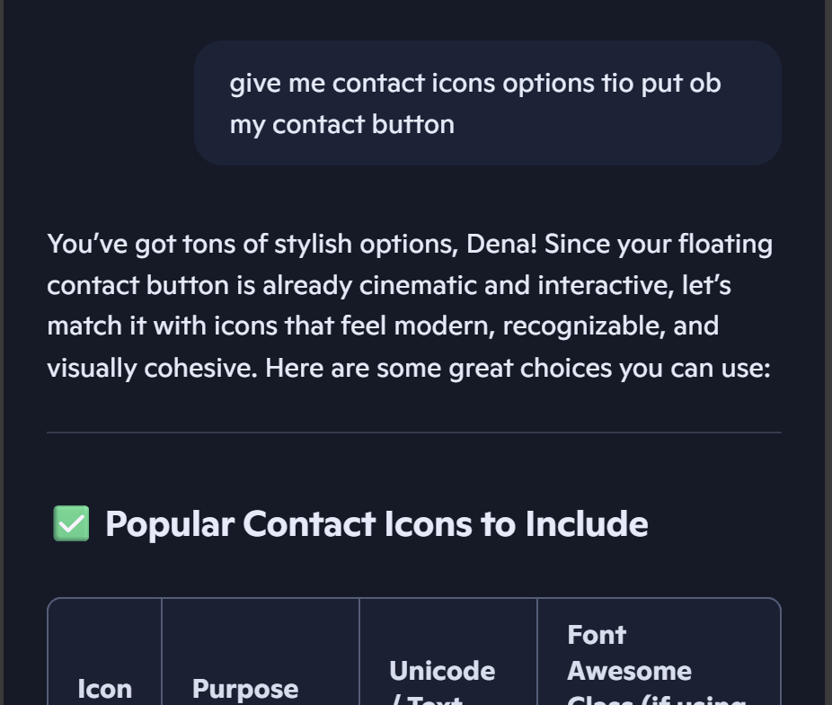
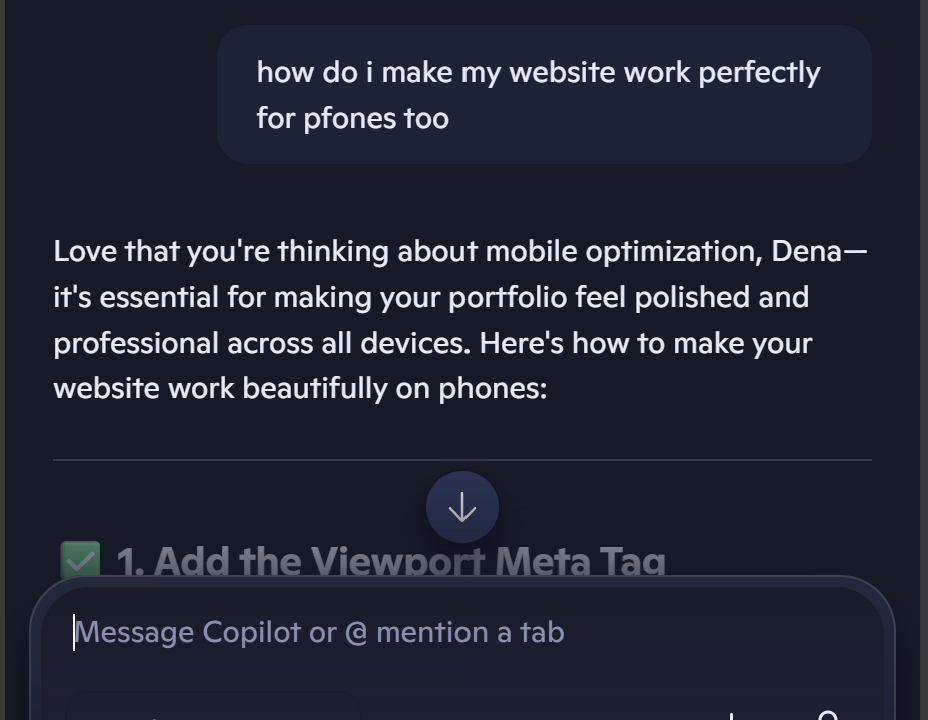
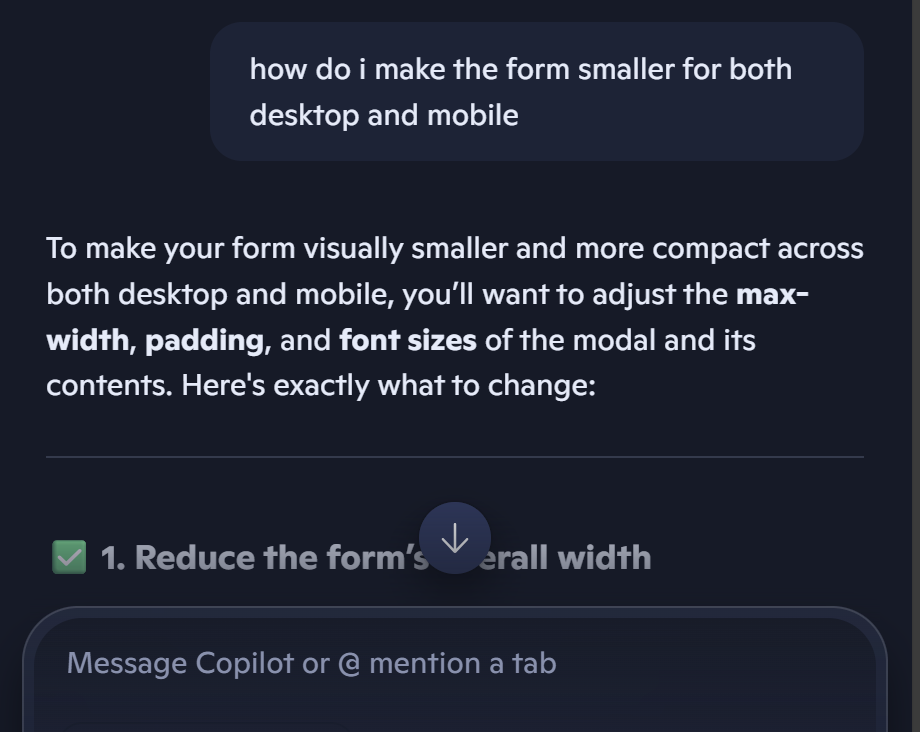

# 🧠 AI Usage Report

### Project: Personal Portfolio Website

**Author:** Dena Alharbi  
**Date:** 25 September 2025

---

## 🎯 Purpose of AI Integration

This report outlines how AI tools were used to support the design, development, and refinement of my personal portfolio
website. The goal was to enhance productivity, troubleshoot layout issues, and explore creative design ideas while
maintaining full ownership of the final product.

---

## 🛠️ Tools Used

- **Microsoft Copilot** – for layout debugging, design suggestions, and creative brainstorming
- **ChatGPT** – for occasional syntax checks and UI inspiration

---

## 📌 Areas Where AI Was Used

### 1. Layout Troubleshooting

- Debugged errors 
- Refined modal and dropdown behavior for the contact section

### 2. Responsive Design

- Suggested flexbox strategies for centering `.intro-wrapper`
- Helped contain overflowing content inside scrollable containers
- Provided CSS transitions and javascript code for smooth section opening

### 3. Creative Enhancements

- Brainstormed animation ideas for section reveals
- Helped with refining and enhancing my css code 
- Added comments to the code to make the project maintainable
- Proposed typography pairings and gradient overlays
- Offered README structure and branding language

### 4. Code Optimization

- Recommended to add texture to the website using https://www.transparenttextures.com/
- Suggested semantic HTML improvements and suggestion on how should my content be grouped

---

## 🔍 AI Contribution vs. Human Work example

| Task                     | AI Role                   | My Role                      |
|--------------------------|---------------------------|------------------------------|
| Timeline scroll fix      | Suggested layout strategy | Implemented and styled       |
| Section transitions      | Provided CSS logic        | Tuned timing and aesthetics  |
| README.md creation       | Drafted structure         | Customized tone and content  |
| Portfolio branding ideas | Offered inspiration       | Selected and refined visuals |

---
## Chat Snippets Examples

 
>  🧾 Ethical Note :  All AI-generated suggestions were reviewed and edited by me to ensure originality, accuracy, and alignment with my personal style and goals. I maintained full creative and technical control throughout the project.

## 🧠 Reflection

Using AI helped me move faster, especially when debugging layout quirks or exploring design ideas. I always reviewed,
customized, and refined the suggestions to match my personal style and goals. The final portfolio reflects my own
decisions, creativity, and technical skill—with AI as a supportive tool, not a substitute.

## 🚀 Future Use of AI

In future projects, I plan to continue using AI tools to accelerate development and enhance quality. This includes leveraging AI for accessibility audits, performance optimization, semantic HTML structuring, and creative ideation. I also aim to explore AI-assisted testing and documentation generation to streamline workflows while maintaining full authorship and oversight.

---
