# 📚 Technical Documentation

### Project: Personal Portfolio Website

**Author:** Dena Alharbi  
**Date:** 25 September 2025

---

## 🧩 Project Structure

```
personal-portfolio-/
├── README.md
├── index.html
├── script.js
├── css/
│   └── styles.css
│   └── projectstyle.css
├── assets/
│   └── images/
│   └── Projects Attachments
├── Docs/
│   ├── Docs-images/
│   ├── ai-usage-report.md
│   └── technical-documentation.md
├── HTML/
│   ├── project1.html
│   ├── project2.html
│   └── project3.html
└── .gitignore

```

---

## 🖼️ UI Components

### Navbar

- Fixed top navigation bar with anchor links to each section
- Smooth scroll behavior using `scrollIntoView`
- Responsive layout using Flexbox<br>
- For desktop: when hovered on, the edges appear in gold<br>
  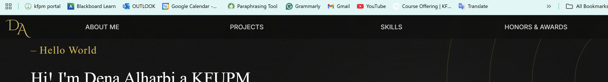
  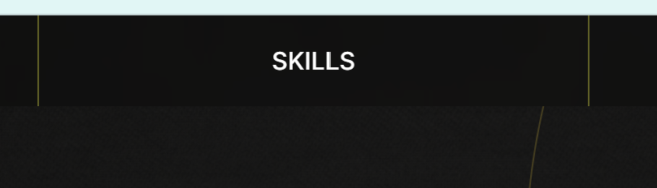
- For mobiles:
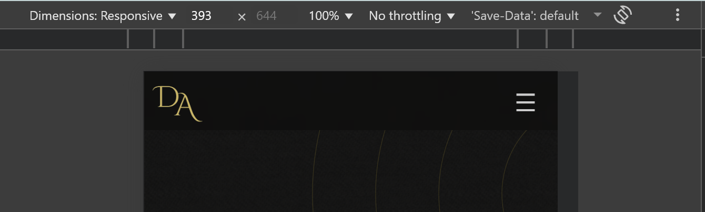


### Contact Button

-On the right-bottom of the screen at all times weather its a desktop or mobile screen there is a button that when
hovered on you can click on anny of the icons taht take you to my linkedin, Github, or Email me using the devices
default app<br>
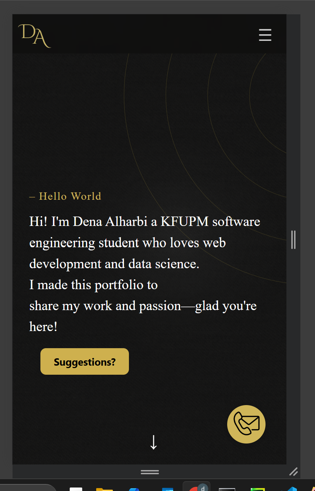
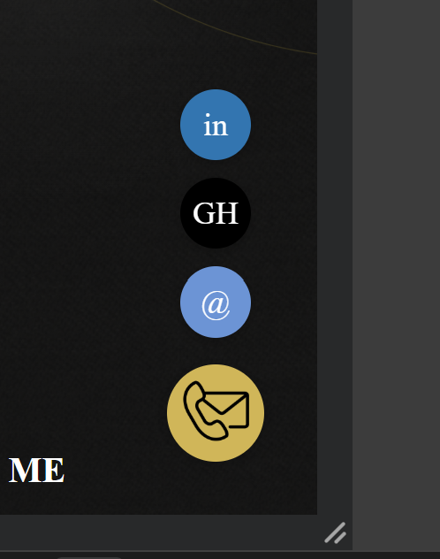

### Suggestions Button

-Under the intro there is a button that when hovered on a form for suggesting ideas for me appears on both desktop and
smaller screens in the middle<br>

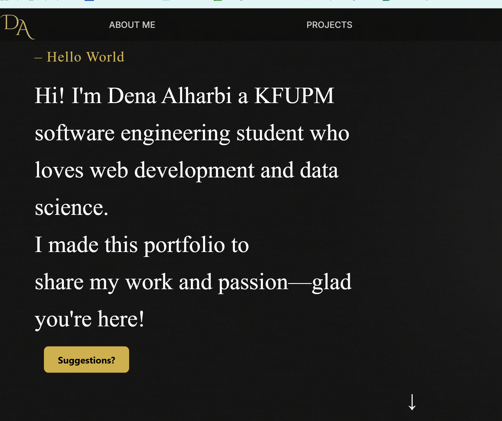
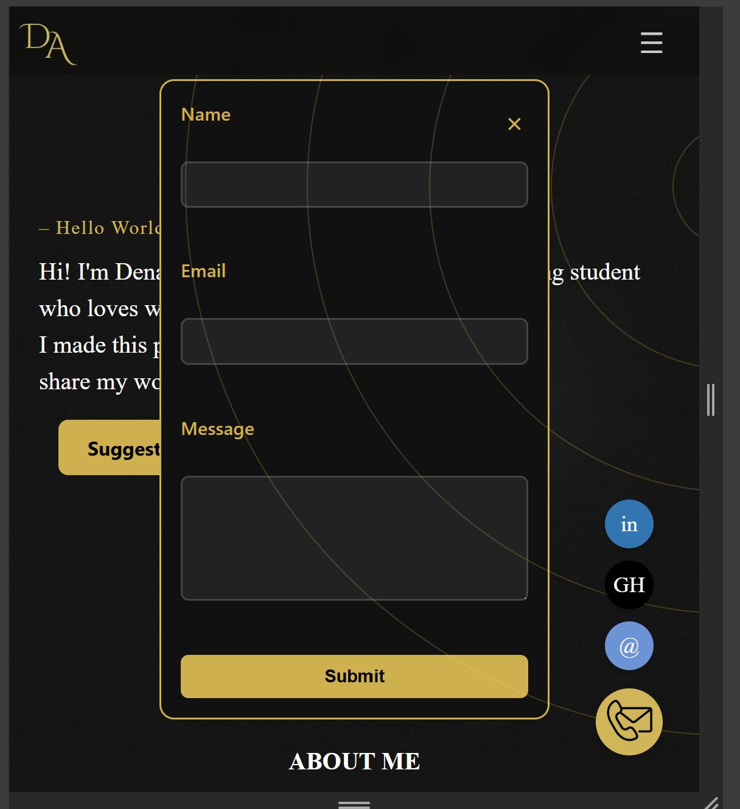

### Sections

- Each section (`.section-block`) includes a `.section-header` and `.section-content`
- Content expands seamlessly with CSS transitions<br>
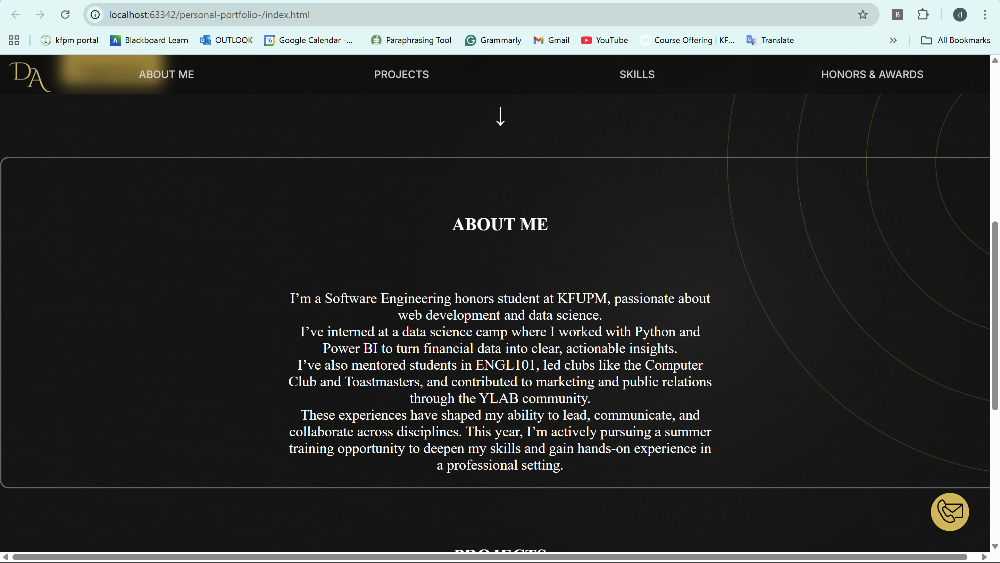
- Projects section has a shape for each project and its linked to a html page that has project details<br>
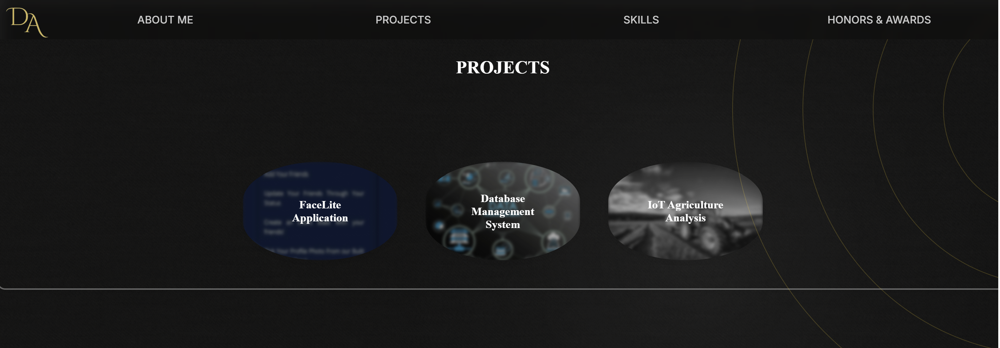
- The details include overview, attachments, and linkin linked for collaborators<br>
- The user can go back to the main page from the "Go Back button"<br>
  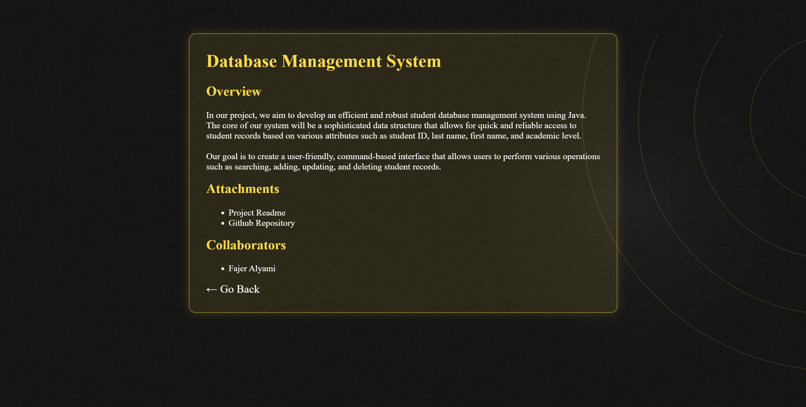
- The skills appear this way<br>
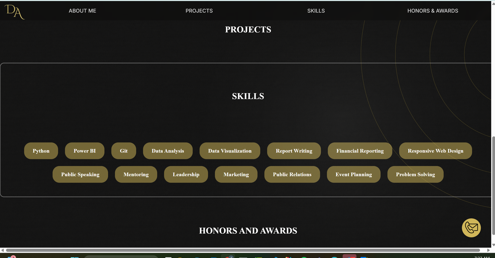

## 🎨 Styling Strategy

The visual styling of the portfolio was crafted to reflect both aesthetic appeal and functional clarity. The design
emphasizes responsiveness, smooth transitions, and brand-consistent typography to enhance user experience across
devices.

- **Responsive Layout**: The site leverages Flexbox for flexible alignment and media queries to adapt layouts for
  mobile, tablet, and desktop screens. `max-width` constraints ensure content remains readable and visually balanced
  regardless of screen size.<br>

> 📱 *This media query targets screens smaller than 500px to optimize readability and layout aesthetics on compact
devices. It adjusts font size, scales decorative elements, and repositions visual accents to maintain clarity and brand
consistency across mobile views.*

```css
/* fine-tune for very small screens */
@media screen and (max-width: 500px) {
    body {
        font-size: 0.95rem;
    }

    body::after {
        width: 80vw;
        height: 80vw;
    }

    .gold-circles {
        top: -9vh;
        transform: scale(0.6) translateY(-10%);
        opacity: 0.15;
        right: -40vw;
    }
}
```

- **Transitions and Interactivity**: Interactive elements such as modals, floating buttons, and dropdowns utilize CSS
  transitions and class toggling (e.g., `.open`, `.show`) to create smooth, cinematic animations. These transitions are
  designed to guide user attention without overwhelming the interface.

- **Typography and Branding**: Font pairings were selected to balance readability with personality. The use of
  `Segoe UI` and accent colors like `#d5b546` reinforces the brand identity while maintaining legibility. Letter-spacing
  and font-weight adjustments were applied to key headings to create hierarchy and rhythm.

- **Visual Hierarchy and Contrast**: Strategic use of spacing, color contrast, and border styling (e.g., gold outlines,
  dark modal backgrounds) helps distinguish interactive zones and content blocks. This ensures accessibility and visual
  clarity.

- **Consistency and Reusability**: Styling follows a modular approach, with reusable classes and consistent spacing
  units. This not only simplifies maintenance but also ensures visual coherence across components.<br>
  Personal Logo:<br>
  
  Responsive layout: <br><br>
  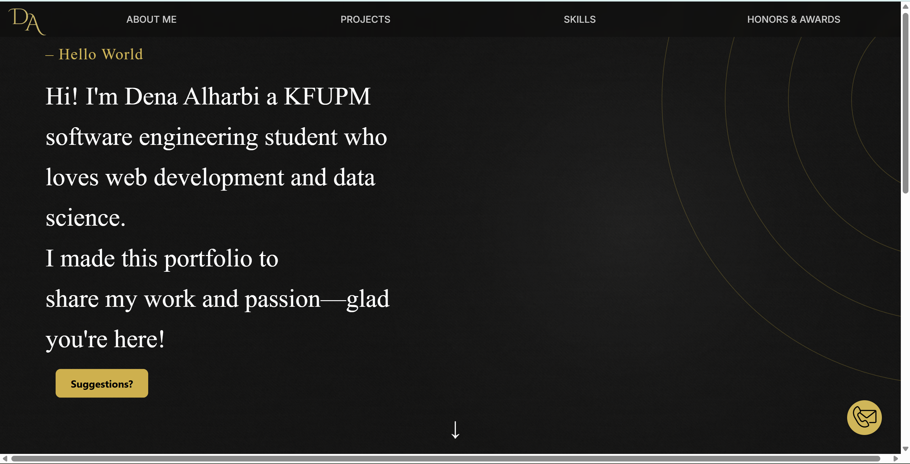
  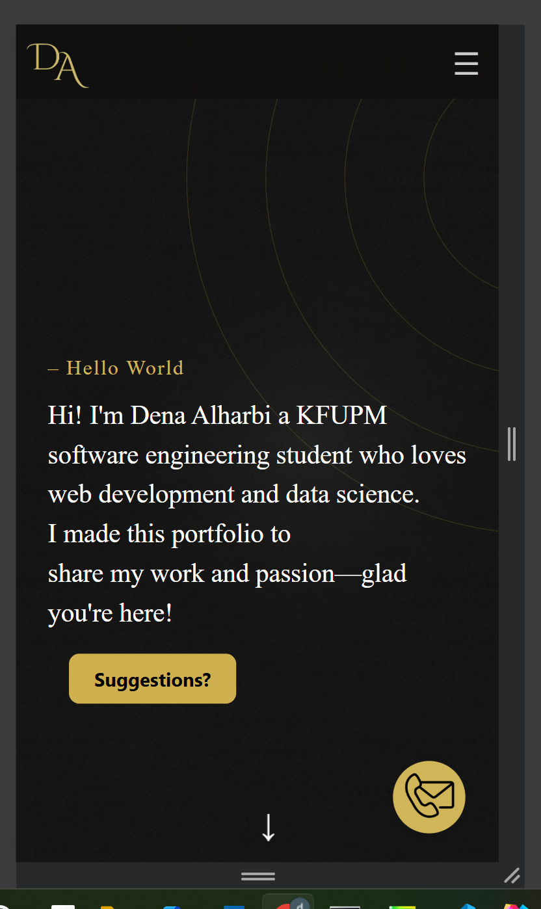

---

## 🧠 JavaScript Logic

### 🔗 Navigation Link Behavior

- Anchor links (`href="#section-id"`) scroll to target sections
- All section auto-expands when clicked via delayed JavaScript trigger

```javascript
document.querySelectorAll('.section-header').forEach(header => {
    header.addEventListener('click', () => {
        const section = header.closest('.section-block');
        const content = section.querySelector('.section-content');

        // Collapse others
        document.querySelectorAll('.section-content').forEach(c => c.classList.remove('open'));

        // Expand selected
        content.classList.add('open');

        // Scroll into view
        setTimeout(() => {
            section.scrollIntoView({behavior: 'smooth', block: 'start'});
        }, 500);
    });
});

```

### Suggestions Button

```javascript
const trigger = document.querySelector('.email-trigger');
const modal = document.getElementById('emailModal');
const closeBtn = document.querySelector('.close-btn');

trigger.addEventListener('click', () => {
    modal.style.display = 'flex';
});

closeBtn.addEventListener('click', () => {
    modal.style.display = 'none';
});

window.addEventListener('click', (e) => {
    if (e.target === modal) {
        modal.style.display = 'none';
    }
});

```

### 🎬 Animation Triggers

- **Fade-in Effects**:  
  Elements like `.email-trigger` and `.intro-section` use CSS animations triggered by class additions or page load. This
  creates a smooth entrance effect that enhances the visual flow of the page.

- **Bounce Effects**:  
  Social icons animate with a custom `@keyframes bounce-nds` when revealed, adding a cinematic touch and drawing
  attention to interactive elements.

### 🧩 Code Organization

The JavaScript logic is structured to support clarity, modularity, and reusability across the portfolio.

- **Readable Syntax**:  
  Code is written using modern ES6 conventions such as `const` and `let` for variable declarations, ensuring scope
  control and readability.

- **Encapsulated Functions**:  
  Functions like `toggleIcons()` are designed to encapsulate specific behaviors, making the codebase easier to maintain
  and extend.

> 📌 *This structure allows for clean separation of concerns, making it easier to debug, scale, and integrate new
features without disrupting existing functionality.*

---

## 🛠️ Technologies Used

| Category   | Tools & Libraries                        |
|------------|------------------------------------------|
| Markup     | HTML5                                    |
| Styling    | CSS3                                     |
| Scripting  | JavaScript                               |
| Design     | Figma (for mockups), Canva (custom logo) |
| Deployment | GitHub Pages                             |

---

## 🔍 Known Issues

- The suggestions button on desktops is not completely in the center
- The suggestions button does not have the backend required
- The contact button does not close if the user interacts with anything else (it has to be clicked to close)

---

## 🧠 Future Enhancements

- Add project filtering with JavaScript
- Add my volunteering experiences using a timeline diagram
- Make the Honors and Award section include the certificates
- Add all my projects

---
# Assignment 1 Checklist

## 1. Repository Setup

- [✅] Maintain a clear folder structure:
- [✅] Ensure a meaningful commit history.<br>
> I have over 60 commits that I tried to make as meaningful as possible and here are some<br>
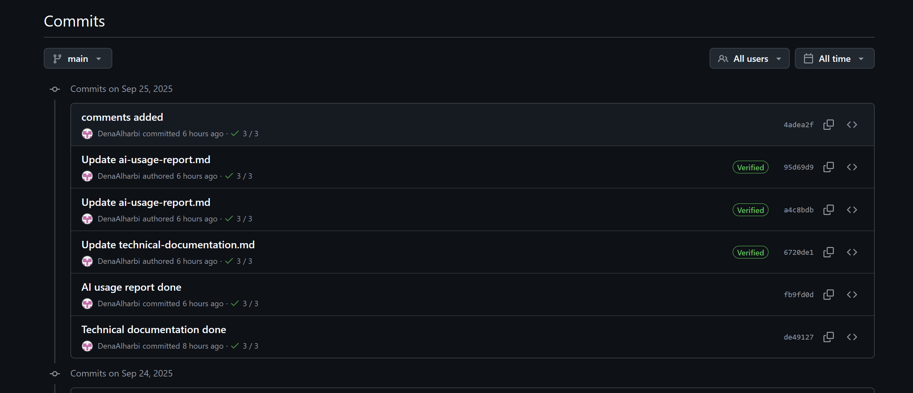
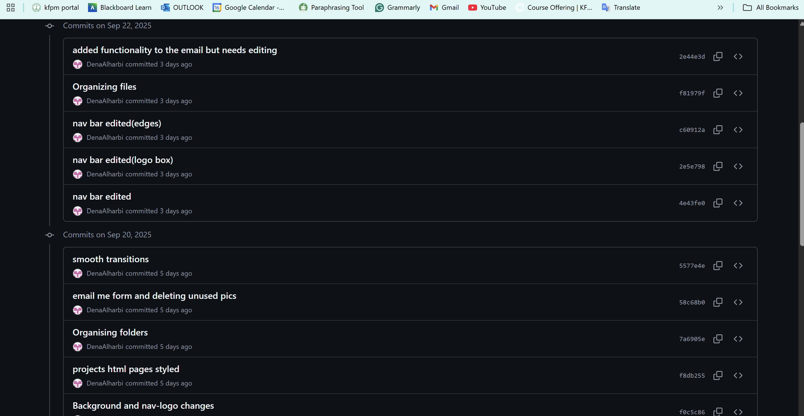

## 2. Content Requirements
- [✅ ] **About Me** section:
    - [✅ ] 2-3 sentence intro. -> About me section 
    - [✅ ] Tagline/one-liner. -> In the first view of the website 
    - [✅ ] Optional profile image.-> I made a logo specifically as a brand
- [✅ ] **Projects** section:
    - [✅ ] At least 2 projects with: -> I did three (when clicked u can see the details) and will add the rest later
        - [ ✅] Title.
        - [ ✅] Short description.
        - [ ✅] Placeholder image.
- [ ✅] **Contact** section: ->I did the contact section as links 
    - [ ✅] Form with fields for: -> I made the form requisite as a suggestions button
        - [ ✅] Name.
        - [✅ ] Email.
        - [✅ ] Message.
- [ ✅] Consider adding extra sections (skills, hobbies, achievements). -> added skills and Honors and Awards Section

## 3. Responsive Design
- [✅] Ensure the site displays well on:
    - [ ✅] Desktop.
    - [ ✅] Tablet.
    - [✅ ] Mobile.
- [✅ ] Use CSS Grid/Flexbox or a lightweight framework (e.g., Bootstrap, Tailwind). used flexbox and responsive units 
- [✅ ] Test responsiveness using browser resizing or DevTools. 

## 4. Interactivity
- [✅] Add at least one JavaScript feature:
    - [✅ ] Smooth scrolling.
    - [ ] Dark/light theme toggle.
    - [ ] Greeting message by time of day.
    - [ ✅] Form or button interactions.

## 5. AI Integration
- [ ✅] Use at least one AI tool (e.g., GitHub Copilot, ChatGPT).
- [ ✅] Document AI usage in `docs/ai-usage-report.md`:
    - [ ✅] Tools used & use cases.
    - [✅ ] Benefits & challenges.
    - [✅ ] Learning outcomes.
    - [✅ ] Modifications made to AI suggestions.

## 6. Code Quality
- [✅] Ensure clean, consistent, well-indented code.
- [ ✅] Add comments for clarity.
- [✅] Remove unused code and broken links.

## 7. Documentation
- [✅] Update `README.md` to include:
    - [✅ ] Project description.
    - [✅ ] Setup instructions.
    - [ ✅] Summary of AI use (link to `ai-usage-report.md`).
    - [✅ ] Optional live deployment link.-> Did it just for mobile 


