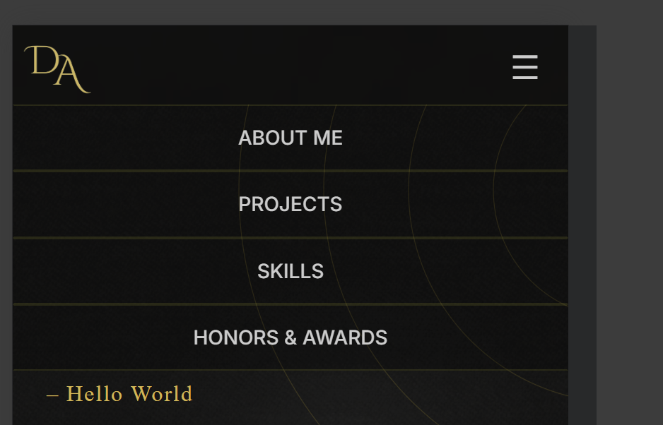

<style>
  img {
    max-width: 300px;
    max-height: 150px;

    height: auto;
  }
</style>
# 📚 Technical Documentation

### Project: Personal Portfolio Website
**Author:** Dena Alharbi  
**Date:** 24 September 2025

---

## 🧩 Project Structure

```
assignment-1/
├── README.md
├── index.html
├── script.js
├── css/
│   └── styles.css
│   └── projectstyle.css
├── assets/
│   └── images/
│   └── Projects Attachments
├── docs/
│   ├── ai-usage-report.md
│   └── technical-documentation.md
├── HTML/
│   ├── project1.html
│   ├── project2.html
│   └── project3.html
└── .gitignore

```

---

## 🖼️ UI Components

### Navbar
- Fixed top navigation bar with anchor links to each section
- Smooth scroll behavior using `scrollIntoView`
- Responsive layout using Flexbox<br>
  <br><br>
  <br>
  

- when hovered on, the edges appear in gold<br>
  
### Contact Button
-On the right-bottom of the screen at all times weather its a desktop or mobile screen there is a button that when hovered on you can click on anny of the icons taht take you to my linkedin, Github, or Email me using the devices default app<br>


### Suggestions Button
-Under the intro  there is a button that when hovered on a form for suggesting ideas for me appears on both desktop and smaller screens in the middle<br>


### Sections
- Each section (`.section-block`) includes a `.section-header` and `.section-content`
- Content expands seamlessly with CSS transitions<br>
  
- Projects section has a shape for each project and its linked to a html page that has project details<br>
  
- The details include overview, attachments, and linkin linked for collaborators<br>
  


## 🎨 Styling Approach

- **Responsive Design**: Uses Flexbox, media queries, and `max-width` constraints
- **Transitions**: Smooth opening effects via `transition` and `.open` class toggling
- **Typography**: Balanced font pairings with emphasis on readability and branding

---

## 🧠 JavaScript Logic

### Section Toggle

```javascript
document.querySelectorAll('.section-header').forEach(header => {
  header.addEventListener('click', () => {
    const section = header.closest('.section-block');
    const content = section.querySelector('.section-content');

    // Collapse others
    document.querySelectorAll('.section-content').forEach(c => c.classList.remove('open'));

    // Expand selected
    content.classList.add('open');

    // Scroll into view
    setTimeout(() => {
      section.scrollIntoView({ behavior: 'smooth', block: 'start' });
    }, 500);
  });
});

```
## 🔗 Navigation Link Behavior

- Anchor links (`href="#section-id"`) scroll to target sections
- All section auto-expands when clicked via delayed JavaScript trigger

---

## 🛠️ Technologies Used

| Category     | Tools & Libraries                       |
|--------------|-----------------------------------------|
| Markup       | HTML5                                   |
| Styling      | CSS3                                    |
| Scripting    | JavaScript                              |
| Design       | Figma (for mockups), Logo (custom logo) |
| Deployment   | GitHub Pages                            |

---
## 🔍 Known Issues

- Honors section may require scroll adjustment on smaller screens
- Modal responsiveness may vary on older browsers

---

## 🧠 Future Enhancements

- Add project filtering with JavaScript
